A simple playground for testing and playing with Vime and its various providers.

<!-- Auto Generated Below -->

## Properties

| Property       | Attribute         | Description                                                         | Type                                                                                                                                            | Default                        |
| -------------- | ----------------- | ------------------------------------------------------------------- | ----------------------------------------------------------------------------------------------------------------------------------------------- | ------------------------------ |
| `poster`       | `poster`          | The current poster to load.                                         | `string`                                                                                                                                        | `${BASE_MEDIA_URL}/poster.png` |
| `provider`     | `provider`        | The current media provider.                                         | `Provider.Audio ∣ Provider.Dailymotion ∣ Provider.Dash ∣ Provider.FakeTube ∣ Provider.HLS ∣ Provider.Video ∣ Provider.Vimeo ∣ Provider.YouTube` | `Provider.Audio`               |
| `showControls` | `show-controls`   | Whether to show the native controls or not.                         | `boolean`                                                                                                                                       | `true`                         |
| `showCustomUI` | `show-custom-u-i` | Whether to show the custom Vime UI or not.                          | `boolean`                                                                                                                                       | `false`                        |
| `src`          | `src`             | The current `src` to load into the provider.                        | `string ∣ undefined`                                                                                                                            | `undefined`                    |
| `theme`        | `theme`           | The current custom UI theme, won't work if custom UI is turned off. | `"dark" ∣ "light"`                                                                                                                              | `'dark'`                       |

## Dependencies

### Depends on

- [vm-audio](../providers/audio.md)
- [vm-video](../providers/video.md)
- [vm-hls](../providers/hls.md)
- [vm-dash](../providers/dash.md)
- [vm-youtube](../providers/youtube.md)
- [vm-vimeo](../providers/vimeo.md)
- [vm-dailymotion](../providers/dailymotion.md)
- [vm-player](player.md)
- [vm-default-ui](../ui/default-ui.md)

### Graph

```mermaid
graph TD;
  vm-playground --> vm-audio
  vm-playground --> vm-video
  vm-playground --> vm-hls
  vm-playground --> vm-dash
  vm-playground --> vm-youtube
  vm-playground --> vm-vimeo
  vm-playground --> vm-dailymotion
  vm-playground --> vm-player
  vm-playground --> vm-default-ui
  vm-audio --> vm-file
  vm-video --> vm-file
  vm-hls --> vm-video
  vm-dash --> vm-video
  vm-youtube --> vm-embed
  vm-vimeo --> vm-embed
  vm-dailymotion --> vm-embed
  vm-default-ui --> vm-ui
  vm-default-ui --> vm-icon-library
  vm-default-ui --> vm-skeleton
  vm-default-ui --> vm-click-to-play
  vm-default-ui --> vm-dbl-click-fullscreen
  vm-default-ui --> vm-captions
  vm-default-ui --> vm-poster
  vm-default-ui --> vm-spinner
  vm-default-ui --> vm-default-controls
  vm-default-ui --> vm-default-settings
  vm-default-controls --> vm-controls
  vm-default-controls --> vm-playback-control
  vm-default-controls --> vm-volume-control
  vm-default-controls --> vm-current-time
  vm-default-controls --> vm-control-spacer
  vm-default-controls --> vm-scrubber-control
  vm-default-controls --> vm-live-indicator
  vm-default-controls --> vm-end-time
  vm-default-controls --> vm-settings-control
  vm-default-controls --> vm-control-group
  vm-default-controls --> vm-fullscreen-control
  vm-default-controls --> vm-scrim
  vm-default-controls --> vm-caption-control
  vm-default-controls --> vm-time-progress
  vm-default-controls --> vm-pip-control
  vm-playback-control --> vm-control
  vm-playback-control --> vm-icon
  vm-playback-control --> vm-tooltip
  vm-volume-control --> vm-mute-control
  vm-volume-control --> vm-slider
  vm-mute-control --> vm-control
  vm-mute-control --> vm-icon
  vm-mute-control --> vm-tooltip
  vm-current-time --> vm-time
  vm-scrubber-control --> vm-slider
  vm-scrubber-control --> vm-tooltip
  vm-end-time --> vm-time
  vm-settings-control --> vm-control
  vm-settings-control --> vm-icon
  vm-settings-control --> vm-tooltip
  vm-fullscreen-control --> vm-control
  vm-fullscreen-control --> vm-icon
  vm-fullscreen-control --> vm-tooltip
  vm-time-progress --> vm-current-time
  vm-time-progress --> vm-end-time
  vm-pip-control --> vm-control
  vm-pip-control --> vm-icon
  vm-pip-control --> vm-tooltip
  vm-default-settings --> vm-menu-item
  vm-default-settings --> vm-menu-radio
  vm-default-settings --> vm-submenu
  vm-default-settings --> vm-menu-radio-group
  vm-default-settings --> vm-settings
  vm-menu-item --> vm-icon
  vm-menu-radio --> vm-menu-item
  vm-submenu --> vm-menu-item
  vm-submenu --> vm-menu
  vm-settings --> vm-menu
  style vm-playground fill:#f9f,stroke:#333,stroke-width:4px
```

---

_Built with [StencilJS](https://stenciljs.com/)_
