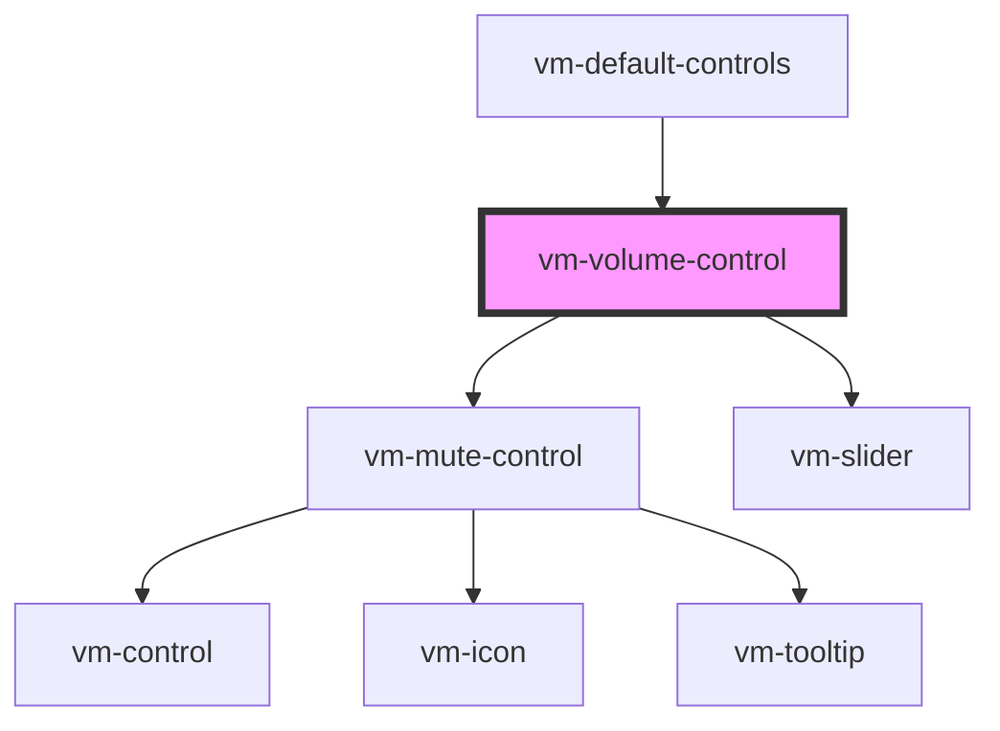

import Tabs from '@theme/Tabs'
import TabItem from '@theme/TabItem'

A control for adjusting the volume of the player and toggling the muted state.

## Visual


<!-- Auto Generated Below -->

## Usage

<Tabs
groupId="framework"
defaultValue="html"
values={[
{ label: 'HTML', value: 'html' },
{ label: 'React', value: 'react' },
{ label: 'Vue', value: 'vue' },
{ label: 'Svelte', value: 'svelte' },
{ label: 'Stencil', value: 'stencil' },
{ label: 'Angular', value: 'angular' }
]}>

<TabItem value="html">

```html {7}
<vm-player>
  <!-- ... -->
  <vm-ui>
    <!-- ... -->
    <vm-controls>
      <!-- ... -->
      <vm-volume-control></vm-volume-control>
    </vm-controls>
  </vm-ui>
</vm-player>
```

</TabItem>


<TabItem value="react">

```tsx {6,16}
import React from 'react';
import { Player, Ui, Controls, VolumeControl } from '@vime/react';

function Example() {
  return (
    <Player>
      {/* ... */}
      <Ui>
        {/* ... */}
        <Controls>
          <VolumeControl />
        </Controls>
      </Ui>
    </Player>
  );
}
```

</TabItem>


<TabItem value="vue">

```html {7,18,26} title="example.vue"
<template>
  <Player>
    <!-- ... -->
    <Ui>
      <!-- ... -->
      <Controls>
        <VolumeControl />
      </Controls>
    </Ui>
  </Player>
</template>

<script>
  import { Player, Ui, Controls, VolumeControl } from '@vime/vue';

  export default {
    components: {
      Player,
      Ui,
      Controls,
      VolumeControl,
    },
  };
</script>
```

</TabItem>


<TabItem value="svelte">

```html {6,16} title="example.svelte"
<Player>
  <!-- ... -->
  <Ui>
    <!-- ... -->
    <Controls>
      <VolumeControl />
    </Controls>
  </Ui>
</Player>

<script lang="ts">
  import { Player, Ui, Controls, VolumeControl } from '@vime/svelte';
</script>
```

</TabItem>


<TabItem value="stencil">

```tsx {9}
class Example {
  render() {
    return (
      <vm-player>
        {/* ... */}
        <vm-ui>
          {/* ... */}
          <vm-controls>
            <vm-volume-control />
          </vm-controls>
        </vm-ui>
      </vm-player>
    );
  }
}
```

</TabItem>


<TabItem value="angular">

```html {7} title="example.html"
<vm-player>
  <!-- ... -->
  <vm-ui>
    <!-- ... -->
    <vm-controls>
      <!-- ... -->
      <vm-volume-control></vm-volume-control>
    </vm-controls>
  </vm-ui>
</vm-player>
```

</TabItem>
    
</Tabs>


## Properties

| Property           | Attribute           | Description                                                                                                                          | Type                           | Default         |
| ------------------ | ------------------- | ------------------------------------------------------------------------------------------------------------------------------------ | ------------------------------ | --------------- |
| `hideTooltip`      | `hide-tooltip`      | Whether the tooltip should be hidden.                                                                                                | `boolean`                      | `false`         |
| `highVolumeIcon`   | `high-volume-icon`  | The name of the high volume icon to resolve from the icon library.                                                                   | `string`                       | `'volume-high'` |
| `icons`            | `icons`             | The name of an icon library to use. Defaults to the library defined by the `icons` player property.                                  | `string ∣ undefined`           | `undefined`     |
| `lowVolumeIcon`    | `low-volume-icon`   | The name of the low volume icon to resolve from the icon library.                                                                    | `string`                       | `'volume-low'`  |
| `muteKeys`         | `mute-keys`         | A pipe (`/`) separated string of JS keyboard keys, that when caught in a `keydown` event, will toggle the muted state of the player. | `string ∣ undefined`           | `'m'`           |
| `mutedIcon`        | `muted-icon`        | The name of the muted volume icon to resolve from the icon library.                                                                  | `string`                       | `'volume-mute'` |
| `noKeyboard`       | `no-keyboard`       | Prevents the volume being changed using the Up/Down arrow keys.                                                                      | `boolean`                      | `false`         |
| `tooltipDirection` | `tooltip-direction` | The direction in which the tooltip should grow.                                                                                      | `"left" ∣ "right" ∣ undefined` | `undefined`     |
| `tooltipPosition`  | `tooltip-position`  | Whether the tooltip is positioned above/below the control.                                                                           | `"bottom" ∣ "top"`             | `'top'`         |

## Dependencies

### Used by

- [vm-default-controls](default-controls.md)

### Depends on

- [vm-mute-control](mute-control.md)
- [vm-slider](../slider.md)

### Graph



---

_Built with [StencilJS](https://stenciljs.com/)_
