import Tabs from '@theme/Tabs'
import TabItem from '@theme/TabItem'

This component is a shorthand way to setup the entire default vime user interface, such as controls,
settings, captions and so on.

## Visuals

There are also alternative interfaces for live media, and the light player theme, but they're not
shown here for the sake of brevity.

### Audio


### Desktop Video


### Mobile Video


<!-- Auto Generated Below -->

## Usage

<Tabs
groupId="framework"
defaultValue="html"
values={[
{ label: 'HTML', value: 'html' },
{ label: 'React', value: 'react' },
{ label: 'Vue', value: 'vue' },
{ label: 'Svelte', value: 'svelte' },
{ label: 'Stencil', value: 'stencil' },
{ label: 'Angular', value: 'angular' }
]}>

<TabItem value="html">

```html {3}
<vm-player>
  <!-- ... -->
  <vm-default-ui></vm-default-ui>
</vm-player>
```

</TabItem>


<TabItem value="react">

```tsx {2,8}
import React from 'react';
import { Player, DefaultUi } from '@vime/react';

function Example() {
  return (
    <Player>
      {/* ... */}
      <DefaultUi />
    </Player>
  );
}
```

</TabItem>


<TabItem value="vue">

```html {4,9,14} title="example.vue"
<template>
  <Player>
    <!-- ... -->
    <DefaultUi />
  </Player>
</template>

<script>
  import { Player, DefaultUi } from '@vime/vue';

  export default {
    components: {
      Player,
      DefaultUi,
    },
  };
</script>
```

</TabItem>


<TabItem value="svelte">

```html {3,7} title="example.svelte"
<Player>
  <!-- ... -->
  <DefaultUi />
</Player>

<script lang="ts">
  import { Player, DefaultUi } from '@vime/svelte';
</script>
```

</TabItem>


<TabItem value="stencil">

```tsx {6}
class Example {
  render() {
    return (
      <vm-player>
        {/* ... */}
        <vm-default-ui />
      </vm-player>
    );
  }
}
```

</TabItem>


<TabItem value="angular">

```html {3} title="example.html"
<vm-player>
  <!-- ... -->
  <vm-default-ui></vm-default-ui>
</vm-player>
```

</TabItem>
    
</Tabs>


## Properties

| Property               | Attribute                 | Description                                                                         | Type      | Default |
| ---------------------- | ------------------------- | ----------------------------------------------------------------------------------- | --------- | ------- |
| `noCaptions`           | `no-captions`             | Whether the custom captions UI should not be loaded.                                | `boolean` | `false` |
| `noClickToPlay`        | `no-click-to-play`        | Whether clicking the player should not toggle playback.                             | `boolean` | `false` |
| `noControls`           | `no-controls`             | Whether the custom default controls should not be loaded.                           | `boolean` | `false` |
| `noDblClickFullscreen` | `no-dbl-click-fullscreen` | Whether double clicking the player should not toggle fullscreen mode.               | `boolean` | `false` |
| `noIconLibrary`        | `no-icon-library`         | Whether the default icon library should be registered.                              | `boolean` | `false` |
| `noPoster`             | `no-poster`               | Whether the custom poster UI should not be loaded.                                  | `boolean` | `false` |
| `noSettings`           | `no-settings`             | Whether the custom default settings menu should not be loaded.                      | `boolean` | `false` |
| `noSkeleton`           | `no-skeleton`             | Whether the skeleton loading animation should be shown while the player is loading. | `boolean` | `false` |
| `noSpinner`            | `no-spinner`              | Whether the custom spinner UI should not be loaded.                                 | `boolean` | `false` |

## Slots

| Slot | Description                                                          |
| ---- | -------------------------------------------------------------------- |
|      | Used to extend the default user interface with custom UI components. |

## Dependencies

### Used by

- [vm-playground](../core/playground.md)

### Depends on

- [vm-ui](ui.md)
- [vm-icon-library](icon-library.md)
- [vm-skeleton](skeleton.md)
- [vm-click-to-play](click-to-play.md)
- [vm-dbl-click-fullscreen](dbl-click-fullscreen.md)
- [vm-captions](captions.md)
- [vm-poster](poster.md)
- [vm-spinner](spinner.md)
- [vm-default-controls](controls/default-controls.md)
- [vm-default-settings](settings/default-settings.md)

### Graph

```mermaid
graph TD;
  vm-default-ui --> vm-ui
  vm-default-ui --> vm-icon-library
  vm-default-ui --> vm-skeleton
  vm-default-ui --> vm-click-to-play
  vm-default-ui --> vm-dbl-click-fullscreen
  vm-default-ui --> vm-captions
  vm-default-ui --> vm-poster
  vm-default-ui --> vm-spinner
  vm-default-ui --> vm-default-controls
  vm-default-ui --> vm-default-settings
  vm-default-controls --> vm-controls
  vm-default-controls --> vm-playback-control
  vm-default-controls --> vm-volume-control
  vm-default-controls --> vm-current-time
  vm-default-controls --> vm-control-spacer
  vm-default-controls --> vm-scrubber-control
  vm-default-controls --> vm-live-indicator
  vm-default-controls --> vm-end-time
  vm-default-controls --> vm-settings-control
  vm-default-controls --> vm-control-group
  vm-default-controls --> vm-fullscreen-control
  vm-default-controls --> vm-scrim
  vm-default-controls --> vm-caption-control
  vm-default-controls --> vm-time-progress
  vm-default-controls --> vm-pip-control
  vm-playback-control --> vm-control
  vm-playback-control --> vm-icon
  vm-playback-control --> vm-tooltip
  vm-volume-control --> vm-mute-control
  vm-volume-control --> vm-slider
  vm-mute-control --> vm-control
  vm-mute-control --> vm-icon
  vm-mute-control --> vm-tooltip
  vm-current-time --> vm-time
  vm-scrubber-control --> vm-slider
  vm-scrubber-control --> vm-tooltip
  vm-end-time --> vm-time
  vm-settings-control --> vm-control
  vm-settings-control --> vm-icon
  vm-settings-control --> vm-tooltip
  vm-fullscreen-control --> vm-control
  vm-fullscreen-control --> vm-icon
  vm-fullscreen-control --> vm-tooltip
  vm-time-progress --> vm-current-time
  vm-time-progress --> vm-end-time
  vm-pip-control --> vm-control
  vm-pip-control --> vm-icon
  vm-pip-control --> vm-tooltip
  vm-default-settings --> vm-menu-item
  vm-default-settings --> vm-menu-radio
  vm-default-settings --> vm-submenu
  vm-default-settings --> vm-menu-radio-group
  vm-default-settings --> vm-settings
  vm-menu-item --> vm-icon
  vm-menu-radio --> vm-menu-item
  vm-submenu --> vm-menu-item
  vm-submenu --> vm-menu
  vm-settings --> vm-menu
  vm-playground --> vm-default-ui
  style vm-default-ui fill:#f9f,stroke:#333,stroke-width:4px
```



---

_Built with [StencilJS](https://stenciljs.com/)_
