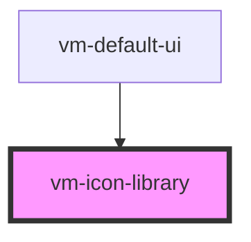

> The implementation was inspired by [Shoelace](https://github.com/shoelace-style/shoelace), thanks Cory!

**Icon libraries let you register additional icons to use with the `<vm-icon>` component.**

An icon library is a renderless component that registers a custom set of SVG icons. The icon files
can exist locally or on a CORS-enabled endpoint (i.e. a CDN). There is no limit to how many icon
libraries you can register, and there is no cost associated with registering them, as individual
icons are only requested when they're used.

To register an icon library, create an <vm-icon-library> element with a name and resolver function.
The resolver function translates an icon name to a URL where its corresponding SVG file exists. Refer
to the examples below to better understand how it works.

<!-- Auto Generated Below -->

## Usage

<Tabs
groupId="framework"
defaultValue="html"
values={[
{ label: 'HTML', value: 'html' },
{ label: 'React', value: 'react' },
{ label: 'Vue', value: 'vue' },
{ label: 'Svelte', value: 'svelte' },
{ label: 'Stencil', value: 'stencil' },
{ label: 'Angular', value: 'angular' }
]}>

<TabItem value="html">

```html {5,8,14-15}
<vm-player icons="material">
  <!-- ... -->
  <vm-ui>
    <!-- Register a predefined icon library (vime, material, remix, boxicons). -->
    <vm-icon-library name="material"></vm-icon-library>

    <!-- Register a custom icon library. -->
    <vm-icon-library name="my-library"></vm-icon-library>
  </vm-ui>
</vm-player>
```

<script>
  const library = document.querySelector('vm-icon-library[name="my-library"]');
  library.resolver = (iconName) => `/icons/${iconName}.svg`;
</script>

</TabItem>


<TabItem value="react">

```tsx {2,10,13}
import React from 'react';
import { Player, Ui, IconLibrary } from '@vime/react';

function Example() {
  return (
    <Player icons="boxicons">
      {/* ... */}
      <Ui>
        {/* Register a predefined icon library (vime, material, remix, boxicons). */}
        <IconLibrary name="boxicons" />

        {/* Register a custom icon library. */}
        <IconLibrary
          name="my-library"
          resolver={(iconName) => `/icons/${iconName}.svg`}
        />
      </Ui>
    </Player>
  );
}
```

</TabItem>


<TabItem value="vue">

```html {6,9,15,20,26} title="example.vue"
<template>
  <Player icons="boxicons">
    <!-- ... -->
    <Ui>
      <!-- Register a predefined icon library (vime, material, remix, boxicons). -->
      <IconLibrary name="boxicons" />

      <!-- Register a custom icon library. -->
      <IconLibrary name="boxicons" :resolver="customResolver" />
    </Ui>
  </Player>
</template>

<script>
  import { Player, Ui, IconLibrary } from '@vime/vue';

  export default {
    data() {
      return {
        customResolver: (iconName) => `/icons/${iconName}.svg`,
      };
    },
    components: {
      Player,
      Ui,
      IconLibrary,
    },
  };
</script>
```

</TabItem>


<TabItem value="svelte">

```svelte {5,8,13} title="example.svelte"
<Player icons="boxicons">
  <!-- ... -->
  <Ui>
    <!-- Register a predefined icon library (vime, material, remix, boxicons). -->
    <IconLibrary name="boxicons" />

    <!-- Register a custom icon library. -->
    <IconLibrary name="my-library" resolver={(iconName) => `/icons/${iconName}.svg`}  />
  </Ui>
</Player>

<script lang="ts">
  import { Player, Ui, IconLibrary } from '@vime/svelte';
</script>
```

</TabItem>


<TabItem value="stencil">

```tsx {8,11}
class Example {
  render() {
    return (
      <vm-player icons="boxicons">
        {/* ... */}
        <vm-ui>
          {/* Register a predefined icon library (vime, material, remix, boxicons). */}
          <vm-icon-library name="boxicons" />

          {/* Register a custom icon library. */}
          <vm-icon-library
            name="my-library"
            resolver={(iconName) => `/icons/${iconName}.svg`}
          />
        </vm-ui>
      </vm-player>
    );
  }
}
```

</TabItem>


<TabItem value="angular">

```html {5,8,15} title="example.html"
<vm-player icons="boxicons">
  <!-- ... -->
  <vm-ui>
    <!-- Register a predefined icon library (vime, material, remix, boxicons). -->
    <vm-icon-library name="boxicons"></vm-icon-library>

    <!-- Register a custom icon library. -->
    <vm-icon-library
      name="my-library"
      [resolver]="customResolver"
    ></vm-icon-library>
  </vm-ui>
</vm-player>
```

```ts title="example.ts"
class Example {
  customResolver = (iconName: string) => `/icons/${iconName}.svg`;
}
```

</TabItem>
    
</Tabs>


## Properties

| Property   | Attribute | Description                                                                                                                                    | Type                                     | Default     |
| ---------- | --------- | ---------------------------------------------------------------------------------------------------------------------------------------------- | ---------------------------------------- | ----------- |
| `name`     | `name`    | The name of the icon library to register. Vime provides some default libraries out of the box such as `vime`, `material`, `remix`, `boxicons`. | `string ∣ undefined`                     | `undefined` |
| `resolver` | --        | A function that translates an icon name to a URL where the corresponding SVG file exists. The URL can be local or a CORS-enabled endpoint.     | `((name: string) => string) ∣ undefined` | `undefined` |

## Dependencies

### Used by

- [vm-default-ui](default-ui.md)

### Graph



---

_Built with [StencilJS](https://stenciljs.com/)_
