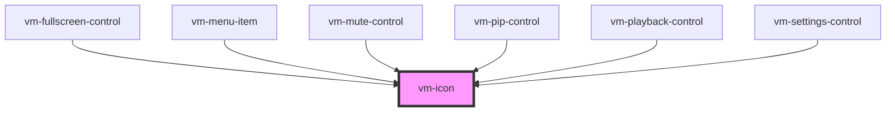

> The implementation was inspired by [Shoelace](https://github.com/shoelace-style/shoelace), thanks Cory!

Loads and renders an SVG icon. The SVG can be loaded locally or through a CORS enabled endpoint. If
you have registered an icon library, you can resolve the icon by name.

<!-- Auto Generated Below -->

## Usage

<Tabs
groupId="framework"
defaultValue="html"
values={[
{ label: 'HTML', value: 'html' },
{ label: 'React', value: 'react' },
{ label: 'Vue', value: 'vue' },
{ label: 'Svelte', value: 'svelte' },
{ label: 'Stencil', value: 'stencil' },
{ label: 'Angular', value: 'angular' }
]}>

<TabItem value="html">

```html
<!-- Src. -->
<vm-icon src="/icons/my-icon.svg" label="An icon"></vm-icon>

<!-- Icon library. -->
<vm-icon name="pause" library="material" label="Pause"></vm-icon>
```

</TabItem>


<TabItem value="react">

```tsx {2,8,11}
import React from 'react';
import { Icon } from '@vime/react';

function Example() {
  return (
    <div>
      {/* Src. */}
      <Icon src="/icons/my-icon.svg" label="An icon" />

      {/* Icon library. */}
      <Icon name="play" library="material" label="Play" />
    </div>
  );
}
```

</TabItem>


<TabItem value="vue">

```html {4,7,12,16} title="example.vue"
<template>
  <div>
    <!-- Src. -->
    <Icon src="/icons/my-icon.svg" label="An icon" />

    <!-- Icon library. -->
    <Icon name="pause" library="material" label="Pause" />
  </div>
</template>

<script>
  import { Icon } from '@vime/vue';

  export default {
    components: {
      Icon,
    },
  };
</script>
```

</TabItem>


<TabItem value="svelte">

```html {2,5,8} title="example.svelte"
<!-- Src. -->
<Icon src="/icons/my-icon.svg" label="An icon" />

<!-- Icon library. -->
<Icon name="pause" library="material" label="Pause" />

<script lang="ts">
  import { Icon } from '@vime/svelte';
<script>
```

</TabItem>


<TabItem value="stencil">

```tsx {6,9}
class Example {
  render() {
    return (
      <div>
        {/* Src. */}
        <vm-icon src="/icons/my-icon.svg" label="An icon" />

        {/* Icon library. */}
        <vm-icon name="play" library="material" label="Play" />
      </div>
    );
  }
}
```

</TabItem>


<TabItem value="angular">

```html title="example.html"
<!-- Src. -->
<vm-icon src="/icons/my-icon.svg" label="An icon"></vm-icon>

<!-- Icon library. -->
<vm-icon name="play" library="material" label="Play"></vm-icon>
```

</TabItem>
    
</Tabs>


## Properties

| Property  | Attribute | Description                                                                                                   | Type                 | Default     |
| --------- | --------- | ------------------------------------------------------------------------------------------------------------- | -------------------- | ----------- |
| `label`   | `label`   | An alternative description to use for accessibility. If omitted, the name or src will be used to generate it. | `string ∣ undefined` | `undefined` |
| `library` | `library` | The name of a registered icon library.                                                                        | `string ∣ undefined` | `undefined` |
| `name`    | `name`    | The name of the icon to draw.                                                                                 | `string ∣ undefined` | `undefined` |
| `src`     | `src`     | The absolute URL of an SVG file to load.                                                                      | `string ∣ undefined` | `undefined` |

## Events

| Event     | Description                           | Type                                            |
| --------- | ------------------------------------- | ----------------------------------------------- |
| `vmError` | Emitted when the icon failed to load. | `CustomEvent<{ status?: number ∣ undefined; }>` |
| `vmLoad`  | Emitted when the icon has loaded.     | `CustomEvent<void>`                             |

## Dependencies

### Used by

- [vm-fullscreen-control](controls/fullscreen-control.md)
- [vm-menu-item](settings/menu-item.md)
- [vm-mute-control](controls/mute-control.md)
- [vm-pip-control](controls/pip-control.md)
- [vm-playback-control](controls/playback-control.md)
- [vm-settings-control](controls/settings-control.md)

### Graph



---

_Built with [StencilJS](https://stenciljs.com/)_
