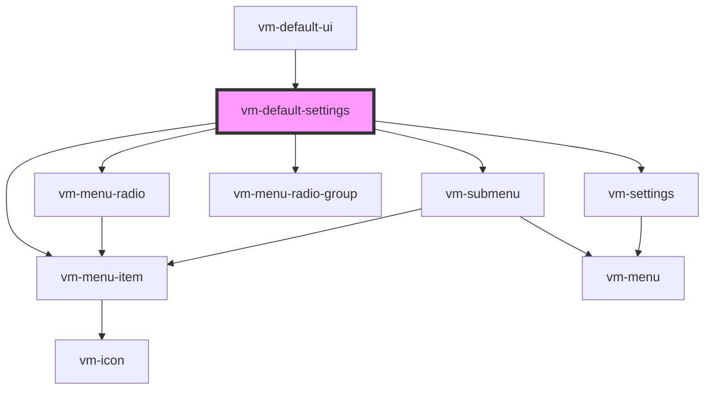

import Tabs from '@theme/Tabs'
import TabItem from '@theme/TabItem'

Creates a settings menu with options for changing the playback rate, quality and captions of
the current media. This component is provider aware. For example, it will only show options for
changing the playback rate if the current provider allows changing it (`player.canSetPlaybackRate()`).
In addition, you can extend the settings with more options via the default `slot`.

## Visual


<!-- Auto Generated Below -->

## Usage

<Tabs
groupId="framework"
defaultValue="html"
values={[
{ label: 'HTML', value: 'html' },
{ label: 'React', value: 'react' },
{ label: 'Vue', value: 'vue' },
{ label: 'Svelte', value: 'svelte' },
{ label: 'Stencil', value: 'stencil' },
{ label: 'Angular', value: 'angular' }
]}>

<TabItem value="html">

```html {5}
<vm-player>
  <!-- ... -->
  <vm-ui>
    <!-- ... -->
    <vm-default-settings></vm-default-settings>
  </vm-ui>
</vm-player>
```

</TabItem>


<TabItem value="react">

```tsx {2,10}
import React from 'react';
import { Player, Ui, DefaultSettings } from '@vime/react';

function Example() {
  return (
    <Player>
      {/* ... */}
      <Ui>
        {/* ... */}
        <DefaultSettings />
      </Ui>
    </Player>
  );
}
```

</TabItem>


<TabItem value="vue">

```html {6,12,18} title="example.vue"
<template>
  <Player>
    <!-- ... -->
    <Ui>
      <!-- ... -->
      <DefaultSettings />
    </Ui>
  </Player>
</template>

<script>
  import { Player, Ui, DefaultSettings } from '@vime/vue';

  export default {
    components: {
      Player,
      Ui,
      DefaultSettings,
    },
  };
</script>
```

</TabItem>


<TabItem value="svelte">

```html {5,10} title="example.svelte"
<Player>
  <!-- ... -->
  <Ui>
    <!-- ... -->
    <DefaultSettings />
  </Ui>
</Player>

<script lang="ts">
  import { Player, Ui, DefaultSettings } from '@vime/svelte';
</script>
```

</TabItem>


<TabItem value="stencil">

```tsx {8}
class Example {
  render() {
    return (
      <vm-player>
        {/* ... */}
        <vm-ui>
          {/* ... */}
          <vm-default-settings />
        </vm-ui>
      </vm-player>
    );
  }
}
```

</TabItem>


<TabItem value="angular">

```html {5} title="example.html"
<vm-player>
  <!-- ... -->
  <vm-ui>
    <!-- ... -->
    <vm-default-settings></vm-default-settings>
  </vm-ui>
</vm-player>
```

</TabItem>
    
</Tabs>


## Properties

| Property | Attribute | Description                                                                                                                                              | Type                                                    | Default         |
| -------- | --------- | -------------------------------------------------------------------------------------------------------------------------------------------------------- | ------------------------------------------------------- | --------------- |
| `pin`    | `pin`     | Pins the settings to the defined position inside the video player. This has no effect when the view is of type `audio`, it will always be `bottomRight`. | `"bottomLeft" ∣ "bottomRight" ∣ "topLeft" ∣ "topRight"` | `'bottomRight'` |

## Slots

| Slot | Description                                                                                        |
| ---- | -------------------------------------------------------------------------------------------------- |
|      | Used to extend the settings with additional menu options (see `vime-submenu` or `vime-menu-item`). |

## Dependencies

### Used by

- [vm-default-ui](../default-ui.md)

### Depends on

- [vm-menu-item](menu-item.md)
- [vm-menu-radio](menu-radio.md)
- [vm-submenu](submenu.md)
- [vm-menu-radio-group](menu-radio-group.md)
- [vm-settings](settings.md)

### Graph



---

_Built with [StencilJS](https://stenciljs.com/)_
