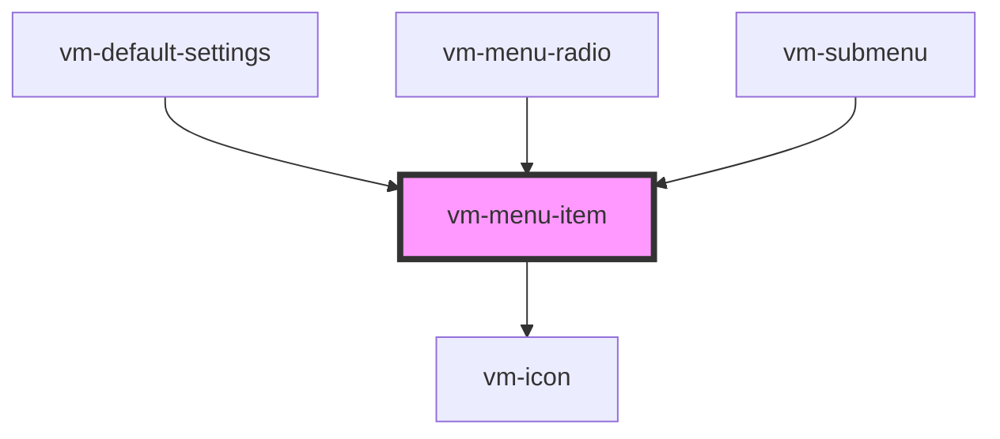

import Tabs from '@theme/Tabs'
import TabItem from '@theme/TabItem'

A multi-purpose interactable element inside a menu. The behaviour and style of the item depends on
the props set.

- **Default:** By default, the menu item only contains a label and optional hint/badge text that is
  displayed on the right-hand side of the item.
- **Navigation:** If the `menu` prop is set, the item behaves as a navigational control and displays
  arrows to indicate whether clicking the control will navigate forwards/backwards.
- **Radio:** If the `checked` prop is set, the item behaves as a radio button and displays a
  checkmark icon to indicate whether it is checked or not.

## Visual


<!-- Auto Generated Below -->

## Usage

<Tabs
groupId="framework"
defaultValue="html"
values={[
{ label: 'HTML', value: 'html' },
{ label: 'React', value: 'react' },
{ label: 'Vue', value: 'vue' },
{ label: 'Svelte', value: 'svelte' },
{ label: 'Stencil', value: 'stencil' },
{ label: 'Angular', value: 'angular' }
]}>

<TabItem value="html">

```html {6}
<vm-player>
  <!-- ... -->
  <vm-ui>
    <!-- ... -->
    <vm-settings>
      <vm-menu-item label="Playback Quality" hint="Auto"></vm-menu-item>
    </vm-settings>
  </vm-ui>
</vm-player>
```

</TabItem>


<TabItem value="react">

```tsx {2,11}
import React from 'react';
import { Player, Ui, Settings, MenuItem } from '@vime/react';

function Example() {
  return (
    <Player>
      {/* ... */}
      <Ui>
        {/* ... */}
        <Settings>
          <MenuItem label="Playback Quality" hint="Auto" />
        </Settings>
      </Ui>
    </Player>
  );
}
```

</TabItem>


<TabItem value="vue">

```html {7,14,21} title="example.vue"
<template>
  <Player>
    <!-- ... -->
    <Ui>
      <!-- ... -->
      <Settings>
        <menuitem label="Playback Quality" hint="Auto" />
      </Settings>
    </Ui>
  </Player>
</template>

<script>
  import { Player, Ui, Settings, MenuItem } from '@vime/vue';

  export default {
    components: {
      Player,
      Ui,
      Settings,
      MenuItem,
    },
  };
</script>
```

</TabItem>


<TabItem value="svelte">

```html {6,16} title="example.svelte"
<Player>
  <!-- ... -->
  <Ui>
    <!-- ... -->
    <Settings>
      <menuitem label="Playback Quality" hint="Auto" />
    </Settings>
  </Ui>
</Player>

<script lang="ts">
  import { Player, Ui, Settings, MenuItem } from '@vime/svelte';
</script>
```

</TabItem>


<TabItem value="stencil">

```tsx {9}
class Example {
  render() {
    return (
      <vm-player>
        {/* ... */}
        <vm-ui>
          {/* ... */}
          <vm-settings>
            <vm-menu-item label="Playback Quality" hint="Auto" />
          </vm-settings>
        </vm-ui>
      </vm-player>
    );
  }
}
```

</TabItem>


<TabItem value="angular">

```html {6} title="example.html"
<vm-player>
  <!-- ... -->
  <vm-ui>
    <!-- ... -->
    <vm-settings>
      <vm-menu-item label="Playback Quality" hint="Auto"></vm-menu-item>
    </vm-settings>
  </vm-ui>
</vm-player>
```

</TabItem>
    
</Tabs>


## Properties

| Property             | Attribute    | Description                                                                                                                                                                                               | Type                  | Default     |
| -------------------- | ------------ | --------------------------------------------------------------------------------------------------------------------------------------------------------------------------------------------------------- | --------------------- | ----------- |
| `badge`              | `badge`      | This can provide additional context about the value of a menu item. For example, if the item is a radio button for a set of video qualities, the badge could describe whether the quality is UHD, HD etc. | `string ∣ undefined`  | `undefined` |
| `checkIcon`          | `check-icon` | The name of the checkmark icon to resolve from the icon library.                                                                                                                                          | `string ∣ undefined`  | `'check'`   |
| `checked`            | `checked`    | If this item is to behave as a radio button, then this property determines whether the radio is selected or not. Sets the `aria-checked` property.                                                        | `boolean ∣ undefined` | `undefined` |
| `expanded`           | `expanded`   | If the item has a popup menu, this indicates whether the menu is open or not. Sets the `aria-expanded` property.                                                                                          | `boolean ∣ undefined` | `undefined` |
| `hidden`             | `hidden`     | Whether the item is displayed or not.                                                                                                                                                                     | `boolean`             | `false`     |
| `hint`               | `hint`       | This can provide additional context about some underlying state of the item. For example, if the menu item opens/closes a submenu with options, the hint could be the currently selected option.          | `string ∣ undefined`  | `undefined` |
| `icons`              | `icons`      | The name of an icon library to use. Defaults to the library defined by the `icons` player property.                                                                                                       | `string ∣ undefined`  | `undefined` |
| `identifier`         | `identifier` | The `id` attribute of the item.                                                                                                                                                                           | `string ∣ undefined`  | `undefined` |
| `label` _(required)_ | `label`      | The label/title of the item.                                                                                                                                                                              | `string`              | `undefined` |
| `menu`               | `menu`       | If the item has a popup menu, then this should be the `id` of said menu. Sets the `aria-controls` property.                                                                                               | `string ∣ undefined`  | `undefined` |

## CSS Custom Properties

| Name                               | Description                                                                  |
| ---------------------------------- | ---------------------------------------------------------------------------- |
| `--vm-menu-item-arrow-color`       | The color of the left/right arrow on a navigational menu item.               |
| `--vm-menu-item-badge-bg`          | The background color of the badge.                                           |
| `--vm-menu-item-badge-color`       | The color of the badge text.                                                 |
| `--vm-menu-item-badge-font-size`   | The font size of the the badge text.                                         |
| `--vm-menu-item-check-icon-height` | The height of the checked icon.                                              |
| `--vm-menu-item-check-icon-width`  | The width of the checked icon.                                               |
| `--vm-menu-item-divider-color`     | The color of the divider between a navigational menu item and the menu body. |
| `--vm-menu-item-focus-bg`          | The background color of a menu item when it is being focused or hovered on.  |
| `--vm-menu-item-focus-color`       | The color of a menu item's text when it is being focused or hovered on.      |
| `--vm-menu-item-hint-color`        | The color of the hint text.                                                  |
| `--vm-menu-item-hint-font-size`    | The font size of the hint text.                                              |
| `--vm-menu-item-hint-opacity`      | The opacity of the hint text.                                                |
| `--vm-menu-item-padding`           | The padding within each menu item.                                           |
| `--vm-menu-item-tap-highlight`     | The highlight color when a menu item is tapped.                              |

## Dependencies

### Used by

- [vm-default-settings](default-settings.md)
- [vm-menu-radio](menu-radio.md)
- [vm-submenu](submenu.md)

### Depends on

- [vm-icon](../icon.md)

### Graph



---

_Built with [StencilJS](https://stenciljs.com/)_
