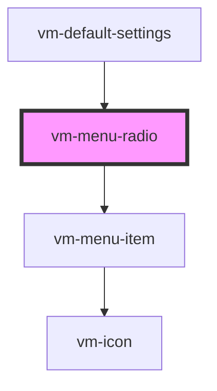

import Tabs from '@theme/Tabs'
import TabItem from '@theme/TabItem'

Menu radio buttons are presented in radio groups (a collection of radio buttons describing a set
of related options). Only one radio button in a group can be selected at the same time.

## Visual


<!-- Auto Generated Below -->

## Usage

<Tabs
groupId="framework"
defaultValue="html"
values={[
{ label: 'HTML', value: 'html' },
{ label: 'React', value: 'react' },
{ label: 'Vue', value: 'vue' },
{ label: 'Svelte', value: 'svelte' },
{ label: 'Stencil', value: 'stencil' },
{ label: 'Angular', value: 'angular' }
]}>

<TabItem value="html">

```html {8-10}
<vm-player>
  <!-- ... -->
  <vm-ui>
    <!-- ... -->
    <vm-settings>
      <vm-submenu label="Playback Rate">
        <vm-menu-radio-group value="1">
          <vm-menu-radio label="0.5" value="0.5" />
          <vm-menu-radio label="Normal" value="1" />
          <vm-menu-radio label="2" value="2" />
        </vm-menu-radio-group>
      </vm-submenu>
    </vm-settings>
  </vm-ui>
</vm-player>
```

</TabItem>


<TabItem value="react">

```tsx {8,20-22}
import React from 'react';
import {
  Player,
  Ui,
  Settings,
  Submenu,
  MenuRadioGroup,
  MenuRadio,
} from '@vime/react';

function Example() {
  return (
    <Player>
      {/* ... */}
      <Ui>
        {/* ... */}
        <Settings>
          <Submenu label="Playback Rate">
            <MenuRadioGroup value="1">
              <MenuRadio label="0.5" value="0.5" />
              <MenuRadio label="Normal" value="1" />
              <MenuRadio label="2" value="2" />
            </MenuRadioGroup>
          </Submenu>
        </Settings>
      </Ui>
    </Player>
  );
}
```

</TabItem>


<TabItem value="vue">

```html {9-11,26,36} title="example.vue"
<template>
  <Player>
    <!-- ... -->
    <Ui>
      <!-- ... -->
      <Settings>
        <Submenu label="Playback Rate">
          <MenuRadioGroup value="1">
            <MenuRadio label="0.5" value="0.5" />
            <MenuRadio label="Normal" value="1" />
            <MenuRadio label="2" value="2" />
          </MenuRadioGroup>
        </Submenu>
      </Settings>
    </Ui>
  </Player>
</template>

<script>
  import {
    Player,
    Ui,
    Settings,
    Submenu,
    MenuRadioGroup,
    MenuRadio,
  } from '@vime/vue';

  export default {
    components: {
      Player,
      Ui,
      Settings,
      Submenu,
      MenuRadioGroup,
      MenuRadio,
    },
  };
</script>
```

</TabItem>


<TabItem value="svelte">

```html {8-10,24} title="example.svelte"
<Player>
  <!-- ... -->
  <Ui>
    <!-- ... -->
    <Settings>
      <Submenu label="Playback Rate">
        <MenuRadioGroup value="1">
          <MenuRadio label="0.5" value="0.5" />
          <MenuRadio label="Normal" value="1" />
          <MenuRadio label="2" value="2" />
        </MenuRadioGroup>
      </Submenu>
    </Settings>
  </Ui>
</Player>

<script lang="ts">
  import {
    Player,
    Ui,
    Settings,
    Submenu,
    MenuRadioGroup,
    MenuRadio,
  } from '@vime/svelte';
</script>
```

</TabItem>


<TabItem value="stencil">

```tsx {11-13}
class Example {
  render() {
    return (
      <vm-player>
        {/* ... */}
        <vm-ui>
          {/* ... */}
          <vm-settings>
            <vm-submenu label="Playback Rate">
              <vm-menu-radio-group value="1">
                <vm-menu-radio label="0.5" value="0.5" />
                <vm-menu-radio label="Normal" value="1" />
                <vm-menu-radio label="2" value="2" />
              </vm-menu-radio-group>
            </vm-submenu>
          </vm-settings>
        </vm-ui>
      </vm-player>
    );
  }
}
```

</TabItem>


<TabItem value="angular">

```html {8-10} title="example.html"
<vm-player>
  <!-- ... -->
  <vm-ui>
    <!-- ... -->
    <vm-settings>
      <vm-submenu label="Playback Rate">
        <vm-menu-radio-group value="1">
          <vm-menu-radio label="0.5" value="0.5" />
          <vm-menu-radio label="Normal" value="1" />
          <vm-menu-radio label="2" value="2" />
        </vm-menu-radio-group>
      </vm-submenu>
    </vm-settings>
  </vm-ui>
</vm-player>
```

</TabItem>
    
</Tabs>


## Properties

| Property             | Attribute    | Description                                                                                                                                                                   | Type                 | Default     |
| -------------------- | ------------ | ----------------------------------------------------------------------------------------------------------------------------------------------------------------------------- | -------------------- | ----------- |
| `badge`              | `badge`      | This can provide additional context about the value. For example, if the option is for a set of video qualities, the badge could describe whether the quality is UHD, HD etc. | `string ∣ undefined` | `undefined` |
| `checkIcon`          | `check-icon` | The URL to an SVG element or fragment to load.                                                                                                                                | `string ∣ undefined` | `'check'`   |
| `checked`            | `checked`    | Whether the radio item is selected or not.                                                                                                                                    | `boolean`            | `false`     |
| `icons`              | `icons`      | The name of an icon library to use. Defaults to the library defined by the `icons` player property.                                                                           | `string ∣ undefined` | `undefined` |
| `label` _(required)_ | `label`      | The title of the radio item displayed to the user.                                                                                                                            | `string`             | `undefined` |
| `value` _(required)_ | `value`      | The value associated with this radio item.                                                                                                                                    | `string`             | `undefined` |

## Events

| Event     | Description                                | Type                |
| --------- | ------------------------------------------ | ------------------- |
| `vmCheck` | Emitted when the radio button is selected. | `CustomEvent<void>` |

## Dependencies

### Used by

- [vm-default-settings](default-settings.md)

### Depends on

- [vm-menu-item](menu-item.md)

### Graph



---

_Built with [StencilJS](https://stenciljs.com/)_
