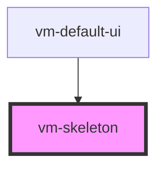

> The implementation was inspired by [Shoelace](https://github.com/shoelace-style/shoelace), thanks Cory!

A temporary placeholder that is used while content is loading.

<!-- Auto Generated Below -->

## Usage

<Tabs
groupId="framework"
defaultValue="html"
values={[
{ label: 'HTML', value: 'html' },
{ label: 'React', value: 'react' },
{ label: 'Vue', value: 'vue' },
{ label: 'Svelte', value: 'svelte' },
{ label: 'Stencil', value: 'stencil' },
{ label: 'Angular', value: 'angular' }
]}>

<TabItem value="html">

```html {5}
<vm-player>
  <!-- ... -->
  <vm-ui>
    <!-- ... -->
    <vm-skeleton></vm-skeleton>
  </vm-ui>
</vm-player>
```

</TabItem>


<TabItem value="react">

```tsx {2,10}
import React from 'react';
import { Player, Ui, Skeleton } from '@vime/react';

function Example() {
  return (
    <Player>
      {/* ... */}
      <Ui>
        {/* ... */}
        <Skeleton />
      </Ui>
    </Player>
  );
}
```

</TabItem>


<TabItem value="vue">

```html {6,12,18} title="example.vue"
<template>
  <Player>
    <!-- ... -->
    <Ui>
      <!-- ... -->
      <Skeleton />
    </Ui>
  </Player>
</template>

<script>
  import { Player, Ui, Skeleton } from '@vime/vue';

  export default {
    components: {
      Player,
      Ui,
      Skeleton,
    },
  };
</script>
```

</TabItem>


<TabItem value="svelte">

```html {5,10} title="example.svelte"
<Player>
  <!-- ... -->
  <Ui>
    <!-- ... -->
    <Skeleton />
  </Ui>
</Player>

<script lang="ts">
  import { Player, Ui, Skeleton } from '@vime/svelte';
</script>
```

</TabItem>


<TabItem value="stencil">

```tsx {8}
class Example {
  render() {
    return (
      <vm-player>
        {/* ... */}
        <vm-ui>
          {/* ... */}
          <vm-skeleton />
        </vm-ui>
      </vm-player>
    );
  }
}
```

</TabItem>


<TabItem value="angular">

```html {5} title="example.html"
<vm-player>
  <!-- ... -->
  <vm-ui>
    <!-- ... -->
    <vm-skeleton></vm-skeleton>
  </vm-ui>
</vm-player>
```

</TabItem>
    
</Tabs>


## Properties

| Property | Attribute | Description                                    | Type               | Default   |
| -------- | --------- | ---------------------------------------------- | ------------------ | --------- |
| `effect` | `effect`  | Determines which effect the skeleton will use. | `"none" ∣ "sheen"` | `'sheen'` |

## CSS Custom Properties

| Name                        | Description                                                |
| --------------------------- | ---------------------------------------------------------- |
| `--vm-skeleton-color`       | The color of the skeleton.                                 |
| `--vm-skeleton-sheen-color` | The sheen color when the skeleton is in its loading state. |
| `--vm-skeleton-z-index`     | The position in the UI z-axis stack inside the player.     |

## Dependencies

### Used by

- [vm-default-ui](default-ui.md)

### Graph



---

_Built with [StencilJS](https://stenciljs.com/)_
