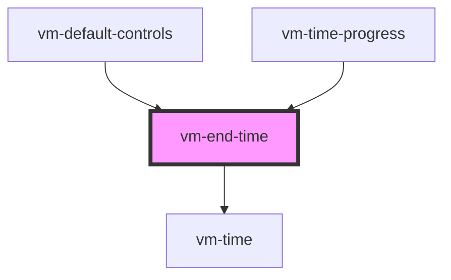

import Tabs from '@theme/Tabs'
import TabItem from '@theme/TabItem'

Formats and displays the duration of the current media.

## Visual


<!-- Auto Generated Below -->

## Usage

<Tabs
groupId="framework"
defaultValue="html"
values={[
{ label: 'HTML', value: 'html' },
{ label: 'React', value: 'react' },
{ label: 'Vue', value: 'vue' },
{ label: 'Svelte', value: 'svelte' },
{ label: 'Stencil', value: 'stencil' },
{ label: 'Angular', value: 'angular' }
]}>

<TabItem value="html">

```html
<vm-end-time />
```

</TabItem>


<TabItem value="react">

```tsx {2,5}
import React from 'react';
import { EndTime } from '@vime/react';

function Example() {
  return <EndTime />;
}
```

</TabItem>


<TabItem value="vue">

```html {2,6,10} title="example.vue"
<template>
  <EndTime />
</template>

<script>
  import { EndTime } from '@vime/vue';

  export default {
    components: {
      EndTime,
    },
  };
</script>
```

</TabItem>


<TabItem value="svelte">

```html {1,4} title="example.svelte"
<EndTime />

<script lang="ts">
  import { EndTime } from '@vime/svelte';
</script>
```

</TabItem>


<TabItem value="stencil">

```tsx {3}
class Example {
  render() {
    return <vm-end-time />;
  }
}
```

</TabItem>


<TabItem value="angular">

```html title="example.html"
<vm-end-time />
```

</TabItem>
    
</Tabs>


## Properties

| Property          | Attribute           | Description                                                                                                           | Type      | Default |
| ----------------- | ------------------- | --------------------------------------------------------------------------------------------------------------------- | --------- | ------- |
| `alwaysShowHours` | `always-show-hours` | Whether the time should always show the hours unit, even if the time is less than 1 hour (eg: `20:35` -> `00:20:35`). | `boolean` | `false` |

## Dependencies

### Used by

- [vm-default-controls](../controls/default-controls.md)
- [vm-time-progress](time-progress.md)

### Depends on

- [vm-time](time.md)

### Graph



---

_Built with [StencilJS](https://stenciljs.com/)_
